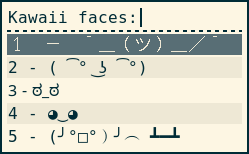
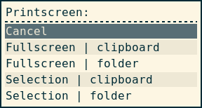

# rofigen - Generates Rofi menu

`rofigen` is a framework to easily create personal [Rofi](https://github.com/DaveDavenport/rofi) menus.

## Getting Started

`rofigen` requires [Rofi](https://github.com/DaveDavenport/rofi).

To run `rofigen` you must pass a script, like `./rofigen ~/kawaiifaces`.

You can bindsym your [i3wm](https://i3wm.org/), e. g., `bindsym $mod+Ctrl+l exec rofigen ~/kawaiifaces`.

### Example #0 - Empty file

```bash
#!/bin/bash

title="title"
widthpercent=number

typeset -A menu
menu=(
    [option 1]="command to execute 1"
    [option 2]="command to execute 2"
)

typeset -A colors
colors=(
    [color-flag]="#color"
)
```


### Example #1 - Kawaii Faces

```bash
#!/bin/bash

title="Kawaii faces:"
widthpercent=13

typeset -A menu
menu=(
    ["1 ¯\_(ツ)_/¯"]="~/sh_kawaiifaces 1"
    [2 ( ͡° ͜ʖ ͡°)]="~/sh_kawaiifaces 2"
    [3 ಠ_ಠ]="~/sh_kawaiifaces 3"
    [4 ◕‿◕]="~/sh_kawaiifaces 4"
    [5 (╯°□°）╯︵ ┻━┻]="~/sh_kawaiifaces 5"
)

typeset -A colors
colors=(
    [-color-window]="#000000, #ffffff, #ffffff"
    [-color-normal]="#ffffff, #000000, #eee8d5, #272727, #ffffff"
    [-color-active]="#fdf6e3, #268bd2, #eee8d5, #268bd2, #fdf6e3"
    [-color-urgent]="#fdf6e3, #dc322f, #eee8d5, #dc322f, #fdf6e3"
)
```

#### Output



### Example #2 - Printscreen

```bash
#!/bin/bash

title="Printscreen:"
widthpercent=15

typeset -A menu
menu=(
  [4 Selection | clipboard]="~/sh_printscreen 4"
  [3 Selection | folder]="~/sh_printscreen 3"
  [2 Fullscreen | clipboard]="~/sh_printscreen 2"
  [1 Fullscreen | folder]="~/sh_printscreen 1"
)

typeset -A colors
colors=(
    [-color-window]="#000000, #ffffff, #ffffff"
    [-color-normal]="#ffffff, #000000, #eee8d5, #272727, #ffffff"
    [-color-active]="#fdf6e3, #268bd2, #eee8d5, #268bd2, #fdf6e3"
    [-color-urgent]="#fdf6e3, #dc322f, #eee8d5, #dc322f, #fdf6e3"
)
```

#### Output



## Configuring

To create a new menu, your script must contain these:

- `title` title displayed
- `widthpercent` set width of menu, is specified in percentage (optional)
- `menu` menu items: [text]="command_to_execute"
- `colors` Rofi colors. You can use the [theme generator](https://davedavenport.github.io/rofi/p11-Generator.html) (optional)
